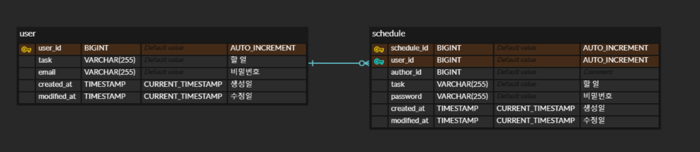

# 📌 일정 관리 앱 API

**Schedule Management Application API**

일정을 관리할 수 있는 애플리케이션의 API 입니다.

## 프로젝트 개요

- 유저 정보를 등록 및 조회할 수 있습니다.
- 일정을 등록, 조회, 수정, 삭제를 할 수 있습니다.
- 여러 일정 조회
  - 작성자 id, 작성일 등을 조건으로 검색할 수 있습니다.
  - 기본적으로 작성일 기준 내림차순으로 정렬됩니다.
  - size, page 등의 쿼리 파라미터를 사용해 Page 단위로 데이터를 받을 수 있습니다. 
- 일정의 수정, 삭제를 할 때에는 등록 시 사용했던 비밀번호가 필요합니다.
- 모든 응답 데이터(JSON body)는 동일한 포맷으로 구성되어 있습니다.

## 개발 환경

- 
- 
- 
- 

## 실행 방법

```bash
git clone https://github.com/NCookies/schedule-management-api.git

cd schedule-management-api

# MySQL 컨테이너를 백그라운드로 실행 (초기화 SQL 함께 실행)
docker-compose up -d

# 프로젝트 빌드 (의존성 다운로드 및 컴파일)
./gradlew build

# 스프링 부트 애플리케이션 실행
./gradlew bootRun

# docker 컨테이너 정지 및 데이터 볼륨까지 삭제
docker-compose down -v
```

## 관련 문서

### API 명세서

[포스트맨 Document](https://documenter.getpostman.com/view/27399553/2sAYkKHHF5)

### ERD



### 트러블 슈팅

- [[내일배움캠프] 일정 관리 API 프로젝트 트러블 슈팅](https://velog.io/@ncookie/%EB%82%B4%EC%9D%BC%EB%B0%B0%EC%9B%80%EC%BA%A0%ED%94%84-%EC%9D%BC%EC%A0%95-%EA%B4%80%EB%A6%AC-API-%ED%94%84%EB%A1%9C%EC%A0%9D%ED%8A%B8-%ED%8A%B8%EB%9F%AC%EB%B8%94-%EC%8A%88%ED%8C%85)

## 응답 데이터

커스텀 응답 클래스를 사용해 클라이언트는 항상 일관된 형식의 데이터를 받을 수 있다. </br> 
(code, status, message, data)

대신 정상 응답 시의 http status는 항상 200으로 고정된다. (에러 발생 시에는 상황에 맞는 status로 설정됨)

- 요청이 정상적으로 처리됐을 때
```json
{
    "status": "CREATED",
    "message": "CREATED",
    "data": {
        "id": 1,
        "userInfo": {
            "id": 1,
            "name": "testuser1",
            "email": "test@email.com"
        },
        "task": "할 일3",
        "createdAt": "2025-03-25T06:36:46",
        "modifiedAt": "2025-03-25T06:36:46"
    },
    "code": 201
}
```
```json
{
    "status": "OK",
    "message": "OK",
    "data": {
        "id": 1,
        "userInfo": {
            "id": 1,
            "name": "testuser1",
            "email": "test@email.com"
        },
        "task": "할 일3",
        "createdAt": "2025-03-25T06:36:46",
        "modifiedAt": "2025-03-25T06:36:46"
    },
    "code": 200
}
```

- 요청 수행 중 에러가 발생했을 때
```json
{
    "status": "NOT_FOUND",
    "message": "존재하지 않는 일정 ID 입니다.",
    "data": null,
    "code": 404
}
```
```json
{
    "status": "BAD_REQUEST",
    "message": "커스텀 요청 파라미터 유효성 검사 실패",
    "data": "findAllSchedules.modified_date: 올바르지 않은 날짜 형식입니다. (형식: yyyy-MM-dd)",
    "code": 400
}
```
```json
{
    "status": "INTERNAL_SERVER_ERROR",
    "message": "서버에 에러가 발생했습니다.",
    "data": "Could not open JDBC Connection for transaction",
    "code": 500
}
```

## 프로젝트 구조

```
📦sma
 ┣ 📂common
 ┃ ┗ 📜ApiResponse.java
 ┣ 📂config
 ┃ ┗ 📜PasswordConfig.java
 ┣ 📂controller
 ┃ ┣ 📜ScheduleController.java
 ┃ ┗ 📜UserController.java
 ┣ 📂dto
 ┃ ┣ 📂request
 ┃ ┃ ┣ 📜ScheduleDeleteRequestDto.java
 ┃ ┃ ┣ 📜ScheduleRequestDto.java
 ┃ ┃ ┣ 📜ScheduleUpdateRequestDto.java
 ┃ ┃ ┗ 📜UserRegisterRequestDto.java
 ┃ ┣ 📂response
 ┃ ┃ ┣ 📜SchedulePageResponseDto.java
 ┃ ┃ ┣ 📜ScheduleResponseDto.java
 ┃ ┃ ┗ 📜UserInfoResponseDto.java
 ┃ ┗ 📜ResponseCode.java
 ┣ 📂entity
 ┃ ┣ 📜Schedule.java
 ┃ ┗ 📜User.java
 ┣ 📂exception
 ┃ ┣ 📜BusinessException.java
 ┃ ┣ 📜GlobalControllerAdvice.java
 ┃ ┣ 📜InvalidPasswordException.java
 ┃ ┗ 📜NotFoundException.java
 ┣ 📂repository
 ┃ ┣ 📜ScheduleRepository.java
 ┃ ┣ 📜ScheduleRepositoryImpl.java
 ┃ ┣ 📜UserRepository.java
 ┃ ┗ 📜UserRepositoryImpl.java
 ┣ 📂service
 ┃ ┣ 📜ScheduleService.java
 ┃ ┣ 📜ScheduleServiceImpl.java
 ┃ ┣ 📜UserService.java
 ┃ ┗ 📜UserServiceImpl.java
 ┣ 📂valid
 ┃ ┣ 📜DateString.java
 ┃ ┗ 📜DateStringValidator.java
 ┗ 📜ScheduleManagementApiApplication.java
```
